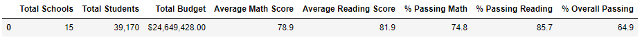

# School_District_Analysis

## Overview of the School District Analysis

The goal of this project is to help Maria remove the reading and math grades for Thomas High School ninth graders due to possible academic dishonesty and re-conduct the school district analysis. The analysis aims to evaluate each school's performance based on their types, budgets, and size. 

## School District Analysis Results

- How is the district summary affected?
    - As can be seen in the following tables, the average math score, percentage of passing math, percentage of passing reading, and the overall passing percentage all dropped after removing the reading and math grades for Thomas High School ninth graders.
    
    Before
    
    After
    
    
- How is the school summary affected?
    - After removing the reading and math grades for Thomas High School ninth graders, the percentage of passing math, percentage of passing reading, and the overall passing percentage all slightly dropped. However, the math and reading average scores slightly increased.
    
    Before
    
    After
    

- How does replacing the ninth graders’ math and reading scores affect Thomas High School’s performance relative to the other schools?
    - Replacing the ninth graders’ math and reading scores does not have too much impact on Thomas High School’s performance relative to the other schools. It is still ranked number 2 on the overall passing percentage.
- How does replacing the ninth-grade scores affect the following:
    - Math and reading scores by grade
        The reading and math grades for Thomas High School ninth graders are not available. Scores for other grades stayed the same. 
    - Scores by school spending, scores by school size, and scores by school type
        The impact on the scores by school spending, scores by school size, and scores by school type of removing the reading and math grades for Thomas High School ninth graders is very minimum. There is hardly any changes on the figures.
    
    
## School District Analysis Summary
Summarize four major changes in the updated school district analysis after reading and math scores for the ninth grade at Thomas High School have been replaced with NaNs.

1. The average math score, percentage of passing math, percentage of passing reading, and the overall passing percentage for the district all dropped after removing the reading and math grades for Thomas High School ninth graders.
2. The Thomas High School's percentage of passing math, percentage of passing reading, and the overall passing percentage all slightly dropped. 
3. The Thomas High School's percentage of the math and reading average scores slightly increased.
4. The impact on the scores by school spending, scores by school size, and scores by school type of removing the reading and math grades for Thomas High School ninth graders is very minimum.
